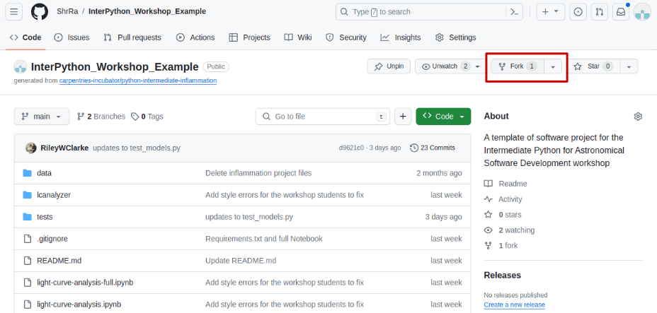
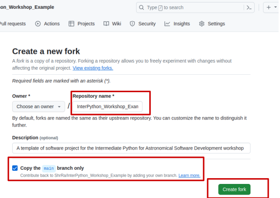
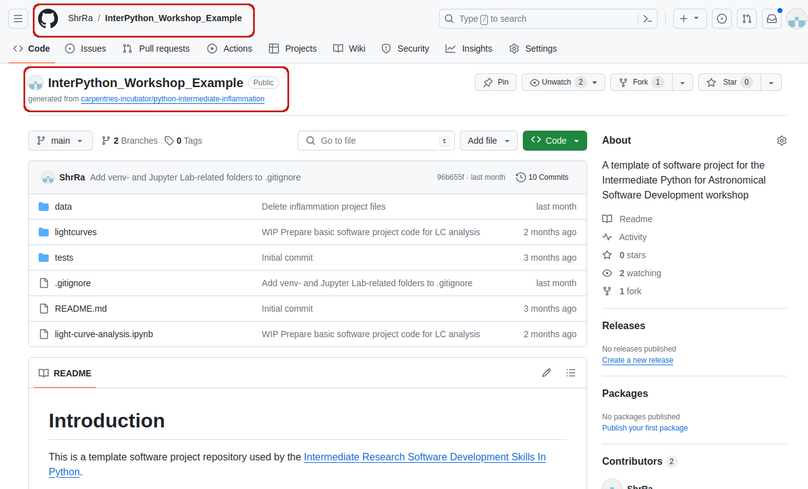
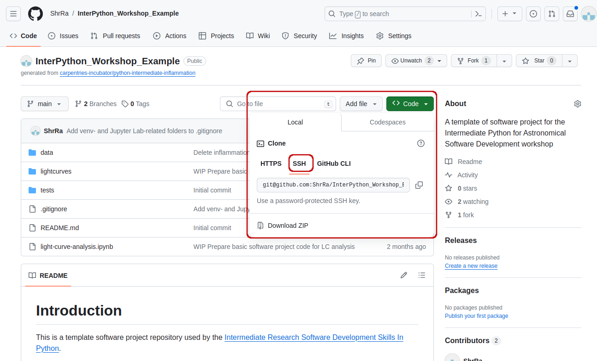
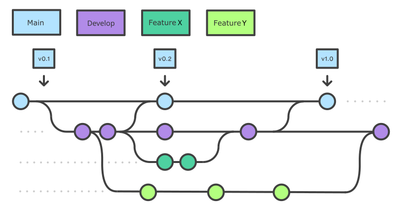
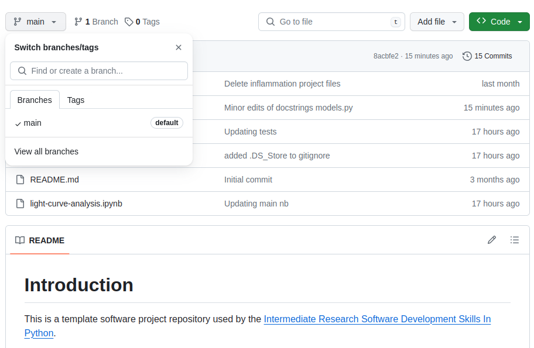

The first section of the course is dedicated to setting up your environment for collaborative software development
and introducing the project that we will be working on throughout the course.
In order to build working (research) software efficiently
and to do it in collaboration with others rather than in isolation,
you will have to get comfortable with using a number of different tools interchangeably
as they’ll make your life a lot easier.
There are many options when it comes to deciding
which software development tools to use for your daily tasks -
we will use a few of them in this course that we believe make a difference.
There are sometimes multiple tools for the job -
we select one to use but mention alternatives too.
As you get more comfortable with different tools and their alternatives,
you will select the one that is right for you based on your personal preferences
or based on what your collaborators are using.

Here is an overview of the tools we will be using.

> ## Setup, Common Issues & Fixes
> Have you [setup and installed](../setup.html) all the tools and accounts required for this course?
> Check the list of [common issues, fixes & tips](../common-issues/index.html)
> if you experience any problems running any of the tools you installed -
> your issue may be solved there.
{: .callout}

### Command Line & Python Virtual Development Environment
We will use the [command line](https://en.wikipedia.org/wiki/Shell_(computing))
(also known as the command line shell/prompt/console)
to run our Python code
and interact with the version control tool Git and software sharing platform GitHub.
We will also use command line tools
[`venv`](https://docs.python.org/3/library/venv.html)
and [`pip`](https://pip.pypa.io/en/stable/)
to set up a Python virtual development environment
and isolate our software project from other Python projects we may work on.

**Note:** *some Windows users experience the issue where Python hangs from Git Bash
(i.e. typing `python` causes it to just hang with no error message or output) -
[see the solution to this issue](../common-issues/index.html#python-hangs-in-git-bash).*

### Integrated Development Environment (IDE)

An IDE integrates a number of tools that we need
to develop a software project that goes beyond a single script -
including a smart code editor, a code compiler/interpreter, a debugger, etc.
It will help you write well-formatted and readable code that conforms to code style guides
(such as [PEP8](https://www.python.org/dev/peps/pep-0008/) for Python)
more efficiently by giving relevant and intelligent suggestions
for code completion and refactoring.
IDEs often integrate command line console and version control tools -
we teach them separately in this course
as this knowledge can be ported to other programming languages
and command line tools you may use in the future
(but is applicable to the integrated versions too).

There are several popular IDEs for Python, such as IDLE, PyCharm, Spyder, VS Studio, 
and so on. In this course, we will use [Jupyter Lab](https://jupyter.org/install) - 
a free, open-source IDE, widely used in the astronomic community.

### Git & GitHub
[Git](https://git-scm.com/) is a free and open source distributed version control system
designed to save every change made to a (software) project,
allowing others to collaborate and contribute.
In this course, we use Git to version control our code in conjunction with [GitHub](https://github.com/)
for code backup and sharing.
GitHub is one of the leading integrated products and social platforms
for modern software development, monitoring and management -
it will help us with
version control,
issue management,
code review,
code testing/Continuous Integration,
and collaborative development.
An important concept in collaborative development is version control workflows
(i.e. how to effectively use version control on a project with others).

Let's get started with setting up our software development environment!

## Downloading Our Software Project

To start working on the project, you will first
create a copy of the software project template repository
from GitHub within your own GitHub account
and then obtain a local copy of that project (from your GitHub) on your machine.

1. Make sure you have a GitHub account
   and that you have set up your SSH key pair for authentication with GitHub,
   as explained in [Setup](../setup.html#secure-access-to-github-using-git-from-command-line).
2. Log into your GitHub account.
3. Go to the [software project repository](https://github.com/ShrRa/InterPython_Workshop_Example)
   in GitHub.

   {: .image-with-shadow width="800px" }

4. Click the `Fork` button towards the top right of the repository’s GitHub page to
   create a fork of the repository under your GitHub account.
   Remember, you will need to be signed into GitHub for the `Fork` button to work.

   _Note: each participant is creating their own fork of the project to work on._
5. Make sure to select your personal account
   and set the name of the project to `InterPython_Workshop_Example`
   (you can call it anything you like,
   but it may be easier for future group exercises if everyone uses the same name).
   For this workshop, set the new repository's visibility to 'Public' -
   In this case, it can be seen by others. Select the `Copy the main branch only` checkbox,
   since you will be creating additional branches by yourself.

   {: .image-with-shadow width="600px" }

7. Click the `Create fork` button
   and wait for GitHub to import the copy of the repository under your account.
8. Locate the forked repository under your own GitHub account. GitHub should redirect you there
   automatically after creating the fork. If this does not happen, click your user icon in the top
   right corner and select Your Repositories from the drop-down menu, then locate your newly created fork.

   {: .image-with-shadow width="800px" }

## Obtaining the Software Project Locally

Using the command line, clone the copied repository from your GitHub account into the home directory on your computer using SSH.

1. Find the SSH URL of the software project repository to clone from your GitHub account. Make sure you do not clone the original template repository but rather your own copy, as you should be able to push commits to it later on. Also make sure you select the **SSH tab** and not the HTTPS one. These two protocols implement different security measures, and since 2021 GitHub offers full support only for the SSH cloning; namely, you won't be able to send your changes to the repository if you use HTTPS method.

{: .image-with-shadow width="800px" }

2. Make sure you are located in your home directory in the command line with:
     ~~~
     $ cd ~
     ~~~
     {: .language-bash}
3. From your home directory in the command line, do:
     ~~~
     $ git clone git@github.com:<YOUR_GITHUB_USERNAME>/InterPython_Workshop_Example.git
     ~~~
     {: .language-bash}
Make sure you are cloning your copy of the software project and not the template repository.

4. Navigate into the cloned repository folder in your command line with:
    ~~~
     $ cd InterPython_Workshop_Example
    ~~~
    {: .language-bash}
Note: If you have accidentally copied the **HTTPS** URL of your repository instead of the SSH one, you can easily fix that from your project folder in the command line with:
    ~~~
    $ git remote set-url origin git@github.com:<YOUR_GITHUB_USERNAME>/InterPython_Workshop_Example.git
    ~~~
    {: .language-bash}

## Setting Up a Virtual Environment for our Project

Let us have a look at how we can create and manage virtual environments from the command line
using `venv` and manage packages using `pip`.

### Creating Virtual Environments Using `venv`
Creating a virtual environment with `venv` is done by executing the following command:

~~~
$ python3 -m venv /path/to/new/virtual/environment
~~~
{: .language-bash}

where `/path/to/new/virtual/environment` is a path to a directory where you want to place it -
conventionally within your software project so they are co-located.
This will create the target directory for the virtual environment
(and any parent directories that don’t exist already).

For our project let's create a virtual environment called "venv".
First, ensure you are within the project root directory, then:

~~~
$ python3 -m venv venv
~~~
{: .language-bash}

If you list the contents of the newly created directory "venv", on a Mac or Linux system
(slightly different on Windows as explained below) you should see something like:

~~~
$ ls -l venv
~~~
{: .language-bash}

~~~
total 8
drwxr-xr-x  12 alex  staff  384  5 Oct 11:47 bin
drwxr-xr-x   2 alex  staff   64  5 Oct 11:47 include
drwxr-xr-x   3 alex  staff   96  5 Oct 11:47 lib
-rw-r--r--   1 alex  staff   90  5 Oct 11:47 pyvenv.cfg
~~~
{: .output}

So, running the `python3 -m venv venv` command created the target directory called "venv"
containing:

- `pyvenv.cfg` configuration file
  with a home key pointing to the Python installation from which the command was run,
- `bin` subdirectory (called `Scripts` on Windows)
  containing a symlink of the Python interpreter binary used to create the environment
  and the standard Python library,
- `lib/pythonX.Y/site-packages` subdirectory (called `Lib\site-packages` on Windows)
  to contain its own independent set of installed Python packages isolated from other projects,
- various other configuration and supporting files and subdirectories.

Once you’ve created a virtual environment, you will need to activate it.

On Mac or Linux, it is done as:
~~~
$ source venv/bin/activate
(venv) $
~~~
{: .language-bash}

On Windows, recall that we have `Scripts` directory instead of `bin`
and activating a virtual environment is done as:

~~~
$ source venv/Scripts/activate
(venv) $
~~~
{: .language-bash}

Activating the virtual environment will change your command line’s prompt
to show what virtual environment you are currently using
(indicated by its name in round brackets at the start of the prompt),
and modify the environment so that running Python will get you
the particular version of Python configured in your virtual environment.

You can verify you are using your virtual environment's version of Python
by checking the path using the command `which`:

~~~
(venv) $ which python3
~~~
{: .language-bash}

~~~
/home/alex/InterPython_Workshop_Example/venv/bin/python3
~~~
{: .output}

When you’re done working on your project, you can exit the environment with:

~~~
(venv) $ deactivate
~~~
{: .language-bash}

If you've just done the `deactivate`,
ensure you reactivate the environment ready for the next part:

~~~
$ source venv/bin/activate
(venv) $
~~~
{: .language-bash}

> ## Python Within A Virtual Environment
>
> Within a virtual environment,
> commands `python` and `pip` will refer to the version of Python you created the environment with.
> If you create a virtual environment with `python3 -m venv venv`,
> `python` will refer to `python3` and `pip` will refer to `pip3`.
>
> On some machines with Python 2 installed,
> `python` command may refer to the copy of Python 2
> installed outside of the virtual environment instead, which can cause confusion.
> You can always check which version of Python you are using in your virtual environment
> with the command `which python` to be absolutely sure.
> We continue using `python3` and `pip3` in this material to avoid confusion for those users,
> but commands `python` and `pip` may work for you as expected.
{: .callout}

### Installing External Packages Using `pip`

We noticed earlier that our code depends on two *external packages/libraries* -
`pandas` and `matplotlib`.
In order for the code to run on your machine,
you need to install these two dependencies into your virtual environment.

To install the latest version of a package with `pip`
you use pip's `install` command and specify the package’s name, e.g.:

~~~
(venv) $ pip3 install pandas
(venv) $ pip3 install matplotlib
~~~
{: .language-bash}

or like this to install multiple packages at once for short:

~~~
(venv) $ pip3 install pandas matplotlib
~~~
{: .language-bash}

### Exporting/Importing Virtual Environments Using `pip`

You are collaborating on a project with a team so, naturally,
you will want to share your environment with your collaborators
so they can easily 'clone' your software project with all of its dependencies
and everyone can replicate equivalent virtual environments on their machines.
`pip` has a handy way of exporting, saving and sharing virtual environments.

To export your active environment -
use `pip3 freeze` command to produce a list of packages installed in the virtual environment.
A common convention is to put this list in a `requirements.txt` file:

~~~
(venv) $ pip3 freeze > requirements.txt
(venv) $ cat requirements.txt
~~~
{: .language-bash}
~~~
contourpy==1.2.0
cycler==0.12.1
fonttools==4.47.2
kiwisolver==1.4.5
matplotlib==3.8.2
numpy==1.26.3
packaging==23.2
pandas==2.1.4
pillow==10.2.0
pyparsing==3.1.1
python-dateutil==2.8.2
pytz==2023.3.post1
six==1.16.0
tzdata==2023.4

~~~
{: .output}

The first of the above commands will create a `requirements.txt` file in your current directory.
Yours may look a little different,
depending on the version of the packages you have installed,
as well as any differences in the packages that they themselves use.

The `requirements.txt` file can then be committed to a version control system
(we will see how to do this using Git in one of the following episodes)
and get shipped as part of your software and shared with collaborators and/or users.
They can then replicate your environment
and install all the necessary packages from the project root as follows:

~~~
(venv) $ pip3 install -r requirements.txt
~~~
{: .language-bash}

As your project grows - you may need to update your environment for a variety of reasons.
For example, one of your project's dependencies has just released a new version
(dependency version number update),
you need an additional package for data analysis (adding a new dependency)
or you have found a better package and no longer need the older package
(adding a new and removing an old dependency).
What you need to do in this case
(apart from installing the new and removing the packages that are no longer needed
from your virtual environment)
is update the contents of the `requirements.txt` file accordingly
by re-issuing `pip freeze` command
and propagate the updated `requirements.txt` file to your collaborators
via your code sharing platform (e.g. GitHub).

## Installing Jupyter Lab
Jupyter Lab itself comes as a Python package. Therefore, we have to install it 
in the environment as well. Another package that we will need for our project is `astropy`,
which provides a lot of functions, useful for writing astronomical software and data processing.

~~~
(venv) $ pip3 install astropy
(venv) $ pip3 install jupyterlab
~~~
{: .language-bash}

Do not forget to update the `requirements.txt` file after the installation is finished. 
If you run `pip freeze`, you will see that Jupyter Lab installed a lot of dependencies libraries,
so the list of requirements is now much larger.

## Checking-in Changes to Our Project
Let's check-in the changes we have done to our project so far.
The first thing to do upon navigating into our software project's directory root
is to check the current status of our local working directory and repository.

~~~
$ git status
~~~
{: .language-bash}

~~~
On branch main
Your branch is up to date with 'origin/main'.

Untracked files:
  (use "git add <file>..." to include in what will be committed)
	requirements.txt
	venv/

nothing added to commit but untracked files present (use "git add" to track)
~~~
{: .output}

As expected,
Git is telling us that we have some untracked files -
`requirements.txt` and directory "venv" -
present in our working directory which we have not
staged nor committed to our local repository yet.
You do not want to commit the newly created directory "venv" and share it with others
because this directory is specific to your machine and setup only
(i.e. it contains local paths to libraries on your system
that most likely would not work on any other machine).
You do, however, want to share `requirements.txt` with your team
as this file can be used to replicate the virtual environment on your collaborators' systems.

To tell Git to intentionally ignore and not track certain files and directories,
you need to specify them in the `.gitignore` text file in the project root.
Our project already has `.gitignore`,
but in cases where you do not have it -
you can simply create it yourself.
In our case, we want to tell Git to ignore the "venv" directory
(and ".venv" as another naming convention for directories containing virtual environments)
and stop notifying us about it.
Edit your `.gitignore` file in a text editor
and add a line containing "venv/" and another one containing ".venv/".
It does not matter much in this case where within the file you add these lines,
so let's do it at the end.
Your `.gitignore` should look something like this:

~~~
# IDEs
.vscode/
.idea/
.ipynb_checkpoints/

# Intermediate Coverage file
.coverage

# Output files
*.png

# Python runtime
*.pyc
*.egg-info
.pytest_cache

# Virtual environments
venv/
.venv/
~~~
{: .output}

You may notice that we are already not tracking certain files and directories
with useful comments about what exactly we are ignoring. For example, we 
have `.ipynb_checkpoints/`, which stores your notebooks' checkpoint files. When you
create a new repository with .ipynb notebooks, you'll have to add this line in the
`.gitignore` yourself. You may also notice that each line in `.gitignore` is actually a pattern,
so you can ignore multiple files that match a pattern
(e.g. "*.png" will ignore all PNG files in the current directory).

If you run the `git status` command now,
you will notice that Git has cleverly understood that
you want to ignore changes to the "venv" directory so it is not warning us about it any more.
However, it has now detected a change to `.gitignore` file that needs to be committed.

~~~
$ git status
~~~
{: .language-bash}

~~~
On branch main
Your branch is up to date with 'origin/main'.

Changes not staged for commit:
  (use "git add <file>..." to update what will be committed)
  (use "git restore <file>..." to discard changes in working directory)
	modified:   .gitignore

Untracked files:
  (use "git add <file>..." to include in what will be committed)
	requirements.txt

no changes added to commit (use "git add" and/or "git commit -a")
~~~
{: .output}

To commit the changes `.gitignore` and `requirements.txt` to the local repository,
we first have to add these files to staging area to prepare them for committing.
We can do that at the same time as:

~~~
$ git add .gitignore requirements.txt
~~~
{: .language-bash}

Now we can commit them to the local repository with:

~~~
$ git commit -m "Add requirements.txt. Ignore venv folders."
~~~
{: .language-bash}

Remember to use meaningful messages for your commits.

So far we have been working in isolation -
all the changes we have done are still only stored locally on our individual machines.
In order to share our work with others,
we should push our changes to the remote repository on GitHub.
Before we push our changes however, we should first do a `git pull`.
This is considered best practice, since any changes made to the repository -
notably by other people -
may impact the changes we are about to push.
This could occur, for example,
by two collaborators making different changes to the same lines in a file.
By pulling first, we are made aware of any changes made by others,
in particular if there are any conflicts between their changes and ours.

~~~
$ git pull
~~~
{: .language-bash}

Now we've ensured our repository is synchronised with the remote one,
we can now push our changes.
Some time ago GitHub
[strengthened authentication requirements for Git operations](https://github.blog/2020-12-15-token-authentication-requirements-for-git-operations/)
accessing GitHub from the command line over HTTPS.
This means you cannot use passwords for authentication over HTTPS any more -
you either need to
[set up and use a personal access token](https://catalyst.zoho.com/help/tutorials/githubbot/generate-access-token.html)
for additional security if you want to continue to use HTTPS,
or switch to use private and public key pair over SSH
before you can push remotely the changes you made locally.
So, when you run the command below:

~~~
$ git push origin main
~~~
{: .language-bash}

> ## Authentication Errors
>
> If you get a warning that HTTPS access is deprecated, or a token is required,
> then you accidentally cloned the repository using HTTPS and not SSH.
> You can fix this from the command line by
> resetting the remote repository URL setting on your local repo:
>
> ~~~
> $ git remote set-url origin git@github.com:<YOUR_GITHUB_USERNAME>/InterPython_Workshop_Example.git
> ~~~
> {: .language-bash}
{: .caution}

In the above command,
`origin` is an alias for the remote repository you used when cloning the project locally
(it is called that by convention and set up automatically by Git
when you run `git clone remote_url` command to replicate a remote repository locally);
`main` is the name of our main (and currently only) development branch.

## Git Branches
When we do `git status`,
Git also tells us that we are currently on the `main` branch of the project.
A branch is one version of your project (the files in your repository)
that can contain its own set of commits.
We can create a new branch,
make changes to the code which we then commit to the branch,
and, once we are happy with those changes,
merge them back to the main branch.
To see what other branches are available, do:

~~~
$ git branch
~~~
{: .language-bash}
~~~
* main
~~~
{: .output}

At the moment, there's only one branch (`main`)
and hence only one version of the code available.
When you create a Git repository for the first time,
by default you only get one version (i.e. branch) - `main`.
Let's have a look at why having different branches might be useful.

### Feature Branch Software Development Workflow
While it is technically OK to commit your changes directly to `main` branch,
and you may often find yourself doing so for some minor changes,
the best practice is to use a new branch for each separate and self-contained unit/piece of work
you want to add to the project.
This unit of work is also often called a *feature*
and the branch where you develop it is called a *feature branch*.
Each feature branch should have its own meaningful name -
indicating its purpose (e.g. "issue23-fix").
If we keep making changes and pushing them directly to `main` branch on GitHub,
then anyone who downloads our software from there will get all of our work in progress -
whether or not it's ready to use!
So, working on a separate branch for each feature you are adding is good for several reasons:

* it enables the main branch to remain stable
  while you and the team explore and test the new code on a feature branch,
* it enables you to keep the untested and not-yet-functional feature branch code
  under version control and backed up,
* you and other team members may work on several features
  at the same time independently from one another,
* if you decide that the feature is not working or is no longer needed -
  you can easily and safely discard that branch without affecting the rest of the code.

Branches are commonly used as part of a feature-branch workflow, shown in the diagram below.

{: .image-with-shadow width="800px"}

Git feature branches 
Adapted from <a href="https://sillevl.gitbooks.io/git/content/collaboration/workflows/gitflow/" target="_blank">Git Tutorial by sillevl</a> (Creative Commons Attribution 4.0 International License)

In the software development workflow,
we typically have a main branch which is the version of the code that is
tested, stable and reliable.
Then, we normally have a development branch
(called `develop` or `dev` by convention)
that we use for work-in-progress code.
As we work on adding new features to the code,
we create new feature branches that first get merged into `develop`
after a thorough testing process.
After even more testing - `develop` branch will get merged into `main`.
The points when feature branches are merged to `develop`,
and `develop` to `main`
depend entirely on the practice/strategy established in the team.
For example, for smaller projects
(e.g. if you are working alone on a project or in a very small team),
feature branches sometimes get directly merged into `main` upon testing,
skipping the `develop` branch step.
In other projects,
the merge into `main` happens only at the point of making a new software release.
Whichever is the case for you, a good rule of thumb is -
nothing that is broken should be in `main`.

### Creating Branches
Let's create a `develop` branch to work on:

~~~
$ git branch develop
~~~
{: .language-bash}

This command does not give any output,
but if we run `git branch` again,
without giving it a new branch name, we can see the list of branches we have -
including the new one we have just made.

~~~
$ git branch
~~~
{: .language-bash}

~~~
    develop
  * main
~~~
{: .output}

The `*` indicates the currently active branch.
So how do we switch to our new branch?
We use the `git checkout` command with the name of the branch:

~~~
$ git checkout develop
~~~
{: .language-bash}

~~~
Switched to branch 'develop'
~~~
 {: .output}

> ## Create and Switch to Branch Shortcut
> A shortcut to create a new branch and immediately switch to it:
>
> ~~~
> $ git checkout -b develop
> ~~~
> {: .language-bash}
>
{: .callout}

### Updating Branches
If we start updating and committing files now,
the commits will happen on the `develop` branch
and will not affect the version of the code in `main`.
We add and commit things to `develop` branch in the same way as we do to `main`.

### Pushing New Branch Remotely
We push the contents of the `develop` branch to GitHub
in the same way as we pushed the `main` branch.
However, as we have just created this branch locally,
it still does not exist in our remote repository.
You can check that in GitHub by listing all branches.

{: .image-with-shadow width="700px"}

To push a new local branch remotely for the first time,
you could use the `-u` switch and the name of the branch you are creating and pushing to:

~~~
$ git push -u origin develop
~~~
{: .language-bash}

> ## Git Push With `-u` Switch
> Using the `-u` switch with the `git push` command is a handy shortcut for:
> (1) creating the new remote branch and
> (2) setting your local branch to automatically track the remote one at the same time.
> You need to use the `-u` switch only once to set up that association between
> your branch and the remote one explicitly.
> After that you could simply use `git push`
> without specifying the remote repository, if you wished so.
> We still prefer to explicitly state this information in commands.
{: .callout}

Let's confirm that the new branch `develop` now exist remotely on GitHub too.
From the `< > Code` tab in your repository in GitHub,
click the branch dropdown menu (currently showing the default branch `main`).
You should see your `develop` branch in the list too. Now the others can check out the `develop` branch too and continue to develop code on it.

After the initial push of the new branch,
each next time we push to it in the usual manner (i.e. without the `-u` switch):

~~~
$ git push origin develop
~~~
{: .language-bash}

### Merging Into Main Branch
Once you have tested your changes on the `develop` branch,
you will want to merge them onto the `main` branch.
To do so, make sure you have all your changes committed and switch to `main`:

~~~
$ git checkout main
~~~
{: .language-bash}

~~~
Switched to branch 'main'
Your branch is up to date with 'origin/main'.
~~~
{: .output}

To merge the `develop` branch on top of `main` do:

~~~
$ git merge develop
~~~
{: .language-bash}

~~~
Updating 05e1ffb..be60389
Fast-forward
 lcanalyzer/models.py | 6 +++---
 1 files changed, 3 insertions(+), 3 deletions(-)
~~~
{: .output}

If there are no conflicts,
Git will merge the branches without complaining
and replay all commits from `develop` on top of the last commit from `main`.
If there are merge conflicts
(e.g. a team collaborator modified the same portion of the same file you are working on
and checked in their changes before you),
the particular files with conflicts will be marked
and you will need to resolve those conflicts
and commit the changes before attempting to merge again.
Since we have no conflicts, we can now push the `main` branch to the remote repository:

~~~
git push origin main
~~~
{: .language-bash}


